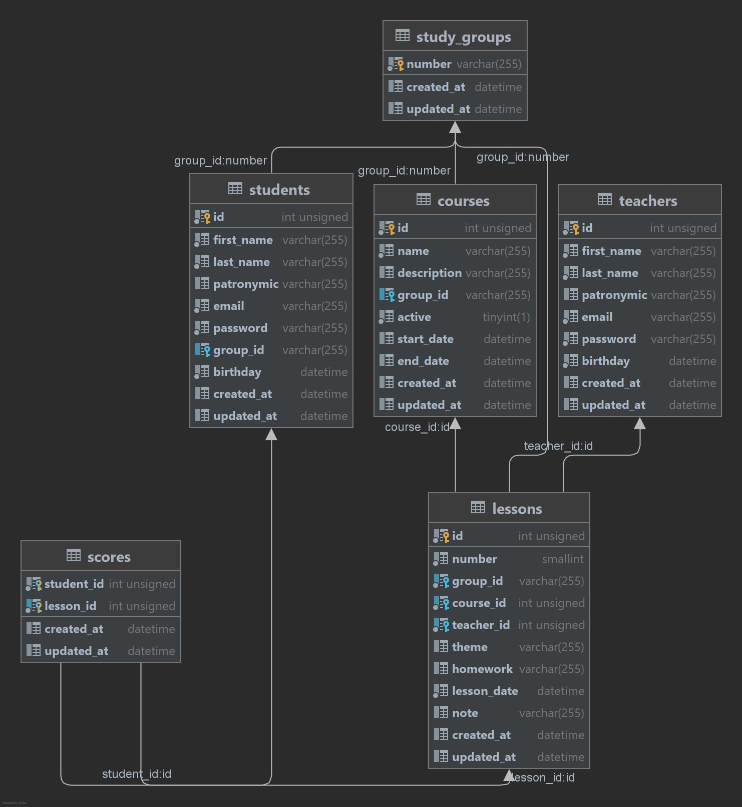

# Курсовой проект курса "Основы реляционных баз данных. MySQL"

## Описание
База данных для проекта "Учебный журнал". 
Проект обеспечивает систему учёта для небольших образовательных курсов, 
например внутри компании. 
База данных даёт возможность, создавать курсы, учебные группы, добавлять преподавателей и студентов, 
а так же вести учёт проведённых занятий и успеваемости.

## Используемые технологии
 - MySQL

## Содержание

 - [DDL - скрипты](ddl.sql)
 - [DUMP с данными](dump.sql)
 - [Внешние ключи](foreign-keys.sql)
 - [Индексы](indexes.sql)
 - [ERDiagram](study_journal.uml)
 - [Типичные запросы выборки](selects.sql)
 - [Представления](views.sql)
 - [Процедуры и триггеры](procedurs.sql)

## ERDiagram

